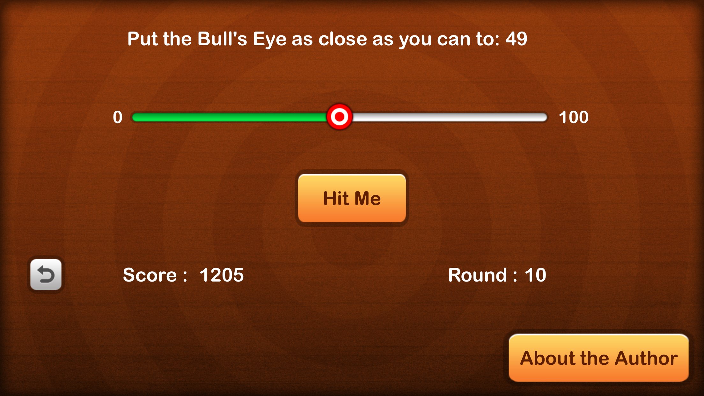
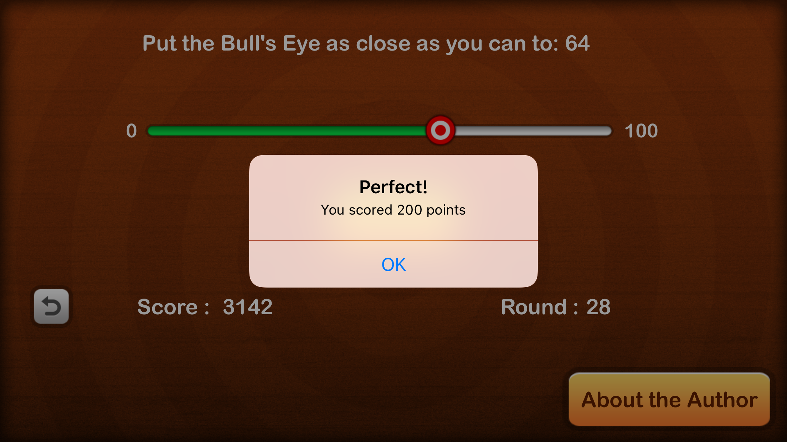
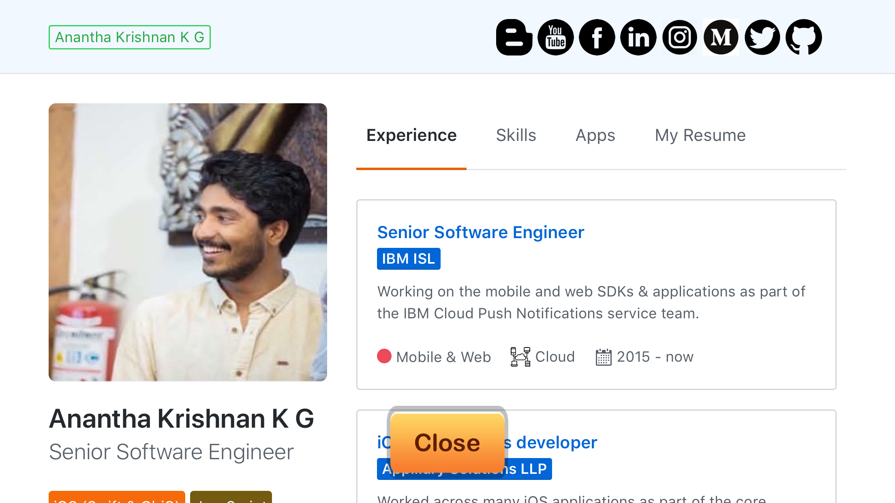

# BullsEye

 BullsEye app from the Ray Wenderlich [Udemy course](https://www.udemy.com/ios-12-and-swift-4-for-beginners-200-hands-on-tutorials/)

 
 
 

## Pending
- [ ] Add multiplayer
- [ ] Add sounds

## Licence
 Under MIT. Read the licence file.